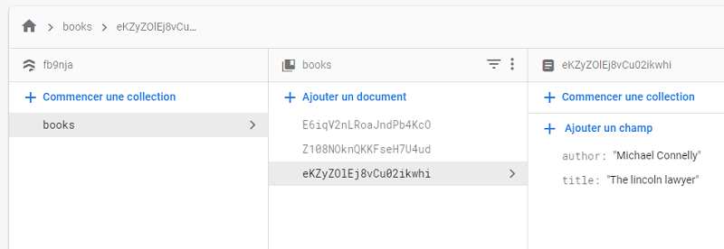

# Firebase tutorial 3

## Ressources
### voir chapitres dans branches
https://github.com/iamshaunjp/Getting-Started-with-Firebase-9

## Firestore database
- créer une database
- Démarrer en mode test
- zone Europe
## Commencer une collection
- Répéter 3 fois
    - Ajouter un document. 
    - Ajout de paires champ/valeurs.

## dans index.js
- Connection de l'app à la database
- Collecte des données et transformation en tableau
