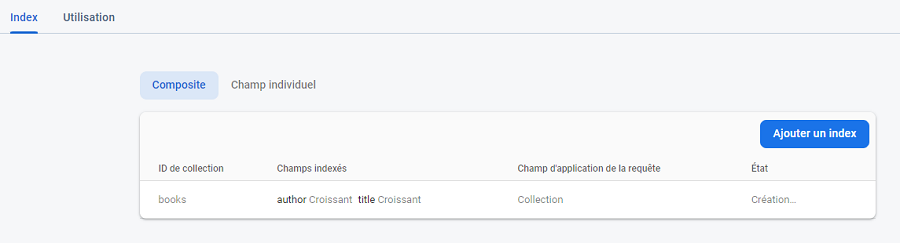

# Firebase tutorial 6, 7 - Requêtes

- Dans les imports : `query` et `where`

## Query by author

```js
// référence d'un requête avec critère
const q = query(colRef, where('author', '==', 'Fred Vargas'))

// Subscription à un écouteur de tout changement dans la collection
 onSnapshot( q, (snapshot) => {
     // même code ensuite
 }
```

## Query by author and ordered 

- Dans les imports : `orderby`
```js
// référence d'un requête par auteur ordonnée par title
 const q = query(colRef, where('author', '==', 'Fred Vargas'), orderBy('title', 'asc'))
 ```
## Problème d'index


## Suivre le lien vers cet onglet
Attendre le résultat. _(quelques minutes)_    


