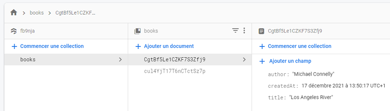

# Firebase  - TimeStamp


## dans la console : FireStore
- on remove la collection `Books`

## dans le script index.js
- Dans les imports : `serverTimeStamp` et `where`

```js
// référence d'un requête par date de création
const q = query(colRef, orderBy('createdAt', 'desc'))


// lors de la soumission on crée un enregistrement avec date de création

    addDoc(colRef, {
        title: addBookForm.title.value,
        author: addBookForm.author.value,
        createdAt: serverTimestamp()

 ```

 ## A l'exécution
 - par défaut => liste vide
 - Ajouter un livre => Il apparaît dans la liste
 - ET dans Firestore
 

